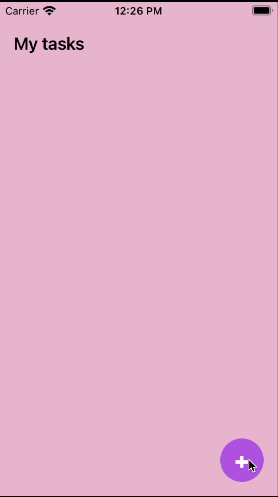

# ToDoList

## Description
Simple To-do list application that implements CRUD using Realm Database

## Technologies Used
- SwiftUI
- Realm Database

## Demo

## Future Implementations
- Have detail view of task
- Associate each task with an optional alarm and deadline feature
